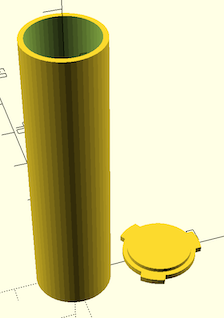

This a simple test tube design for fitting into a Nalgene test tube case (5x5 slots).

It's just a cylinder and a fitting lid. The lid has three little tabs which

* makes opening tube easier
* stops tube rolling off table

<table>
  <tr>
    <td></td>
    <td></td>
  </tr>
</table>

